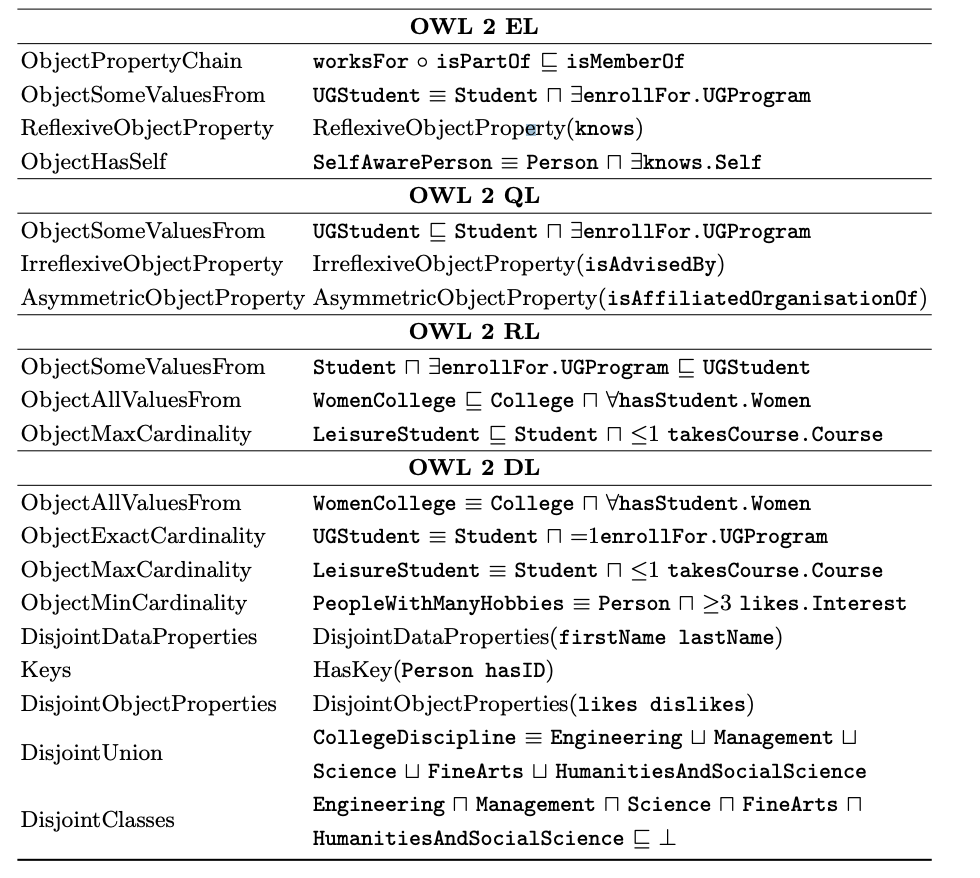
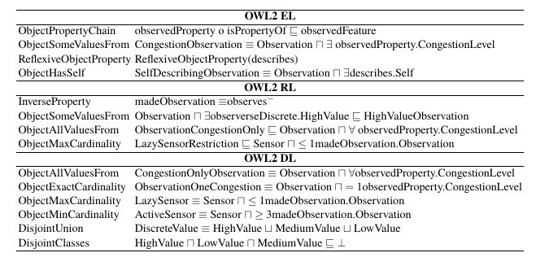

# OWL2Streams
A benchmark for expressive stream reasoning for dynamic OWL2 Reasoners

OWL2Streams supports three use cases:

- A Smart Building case, requiring the detection COVID-19 risks
- An extension of the OWL2Bench benchmark [1] where the stream consists of students registering to a certain university. 
- An extension of the CityBench benchmark [2], containing more elaborate background knowledge.

# Usage:
```
USAGE: <type>[University|City|Building] <size>[int]
```
For example:
```
java -jar owl2streams.jar University 10
```

This will open 3 entry points:

- url/tbox: allowing to get the ontology TBox
- url/abox: allowing to get the ontology static ABox
- url/event: allowing to pull the next event in the stream

# Compilation
```
mvn clean compile assembly:single
mv target/OWL2Streams-0.0.1-jar-with-dependencies.jar owl2streams.jar
```

# Ontology Schemas
Below, we show the used Ontology TBoxes:

- OWL2Bench TBox as defined in [1]


- CityBenchPlus TBox as an extension of [2]


# References
[1] Singh, G., Bhatia, S. and Mutharaju, R., 2020, November. OWL2Bench: A Benchmark for OWL 2 Reasoners. In International Semantic Web Conference (pp. 81-96). Springer, Cham.

[2] Ali, M.I., Gao, F. and Mileo, A., 2015, October. Citybench: A configurable benchmark to evaluate rsp engines using smart city datasets. In International Semantic Web Conference (pp. 374-389). Springer, Cham.
